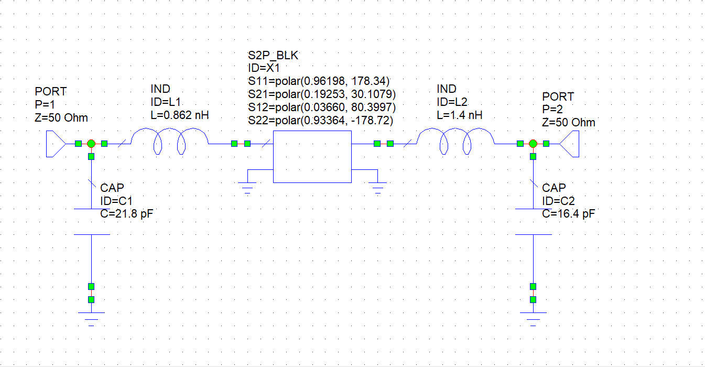
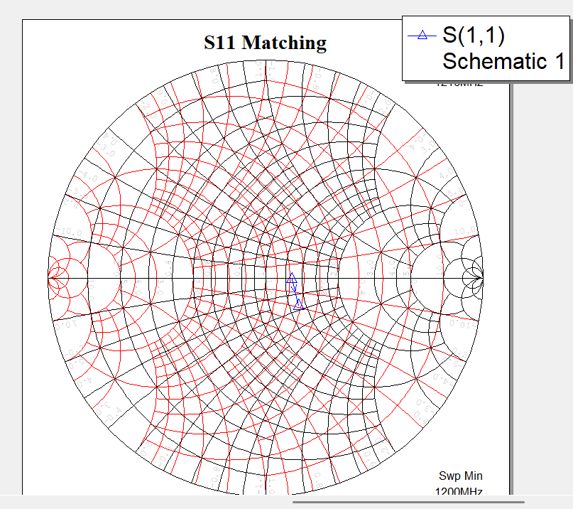
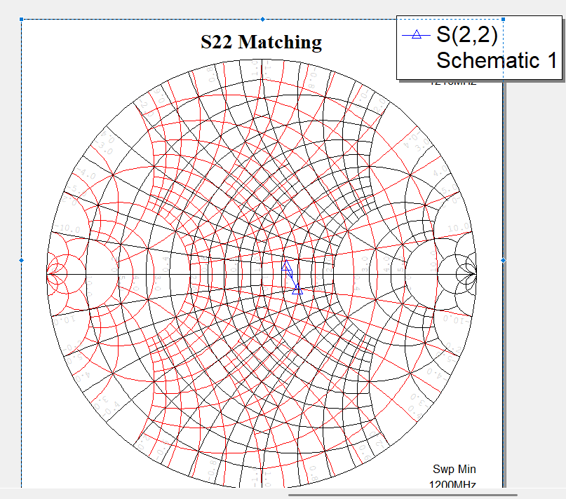
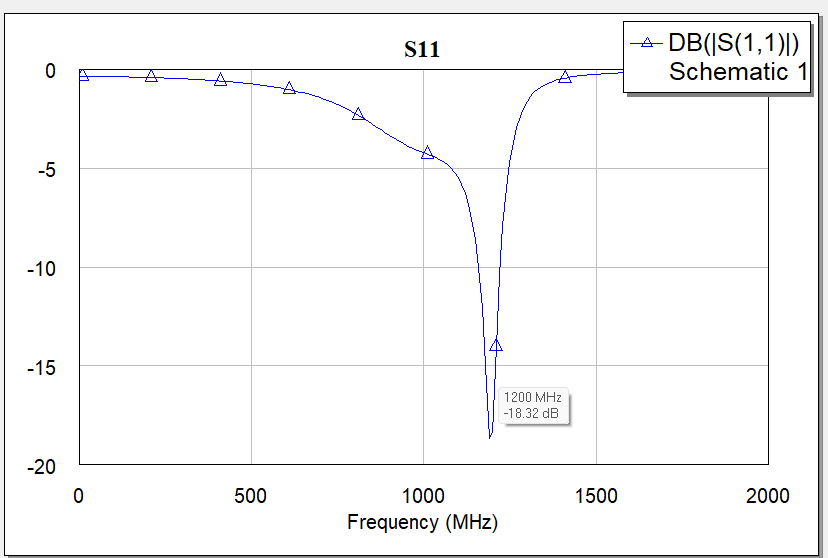
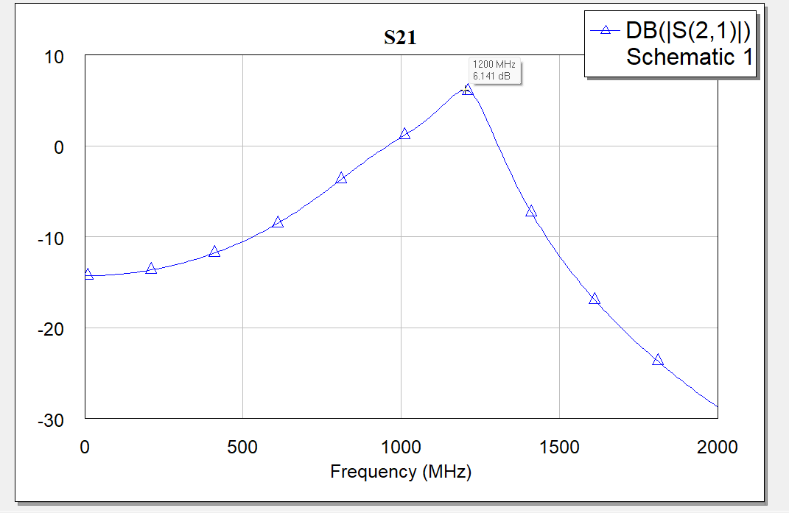
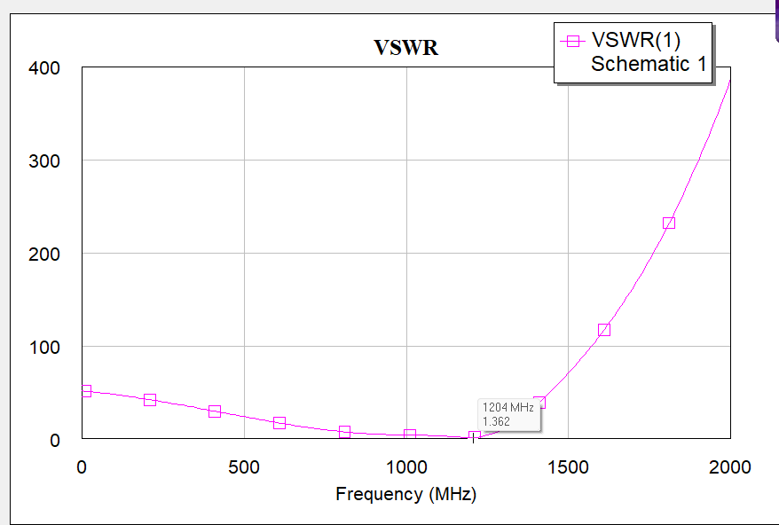

<p align="center">
  <a href="README.md">Русский</a> | <a href="README.en.md">English</a> | <b>Deutsch</b>
</p>

# 2sk2974-1g2-match: Impedanzanpassung des UHF-MOSFET-Viertors 2SK2974 bei 1,2 GHz

Dieses Repository enthält das Simulationsprojekt eines reaktiven Anpassungsnetzwerks mit konzentrierten Elementen für den UHF-Leistungs-MOSFET **2SK2974** bei einer Betriebsfrequenz von **1,2 GHz (1200 MHz)**. Das Netzwerk passt das Zweitor an $50\ \Omega$-Referenztore an.

Die Schaltungssimulation wurde in **Cadence AWR Microwave Office (MWO)** durchgeführt. Das Repository enthält den Schaltplan, Smith-Diagramme sowie Frequenzgänge des Reflexionsfaktors ($S_{11}$) und des Stehwellenverhältnisses (VSWR).

---

## Projektstruktur

```text
├── cad/                                        # 3D-CAD-Modelle und PCB-Layoutdateien
│   └── .gitkeep
├── calculations/                               # Mathematische Modelle (Mathcad, SMath)
│   └── .gitkeep
├── docs/
│   └── images/                                 # Dokumentationsgrafiken, Schaltpläne und Simulationsergebnisse
│       ├── plot_s11_frequency_response.png     # Frequenzgang des Eingangsreflexionsfaktors |S11| (dB)
│       ├── plot_s21_frequency_response.png     # Frequenzgang des Vorwärtsübertragungsfaktors |S21| (dB)
│       ├── plot_vswr_frequency_response.png    # Frequenzgang des Stehwellenverhältnisses (VSWR)
│       ├── schematic_2sk2974_matching_1200mhz.png # Schaltplan in Cadence AWR Microwave Office
│       ├── smith_chart_s11_matching.png        # Smith-Diagramm für S11
│       └── smith_chart_s22_matching.png        # Smith-Diagramm für S22
├── simulation/                                 # Numerische Simulationsdateien
│   └── transistor_2sk2974_matching_1200mhz.emp # Cadence AWR Microwave Office Projektdatei
├── .gitignore                                  # Ausschlussregeln für EDA- und Betriebssystemdateien
├── LICENSE                                     # Vollständiger Lizenztext der CERN-OHL-P v2
├── README.de.md                                # Dokumentation in deutscher Sprache
├── README.en.md                                # Dokumentation in englischer Sprache
└── README.md                                   # Dokumentation in russischer Sprache
```

---

## Transistorparameter

Das aktive Bauelement ist als lineares Viertor/Zweitor modelliert (`S2P_BLK ID=X1`). Bei der Betriebsfrequenz $f_0 = 1,2\text{ GHz}$ lauten die Streuparameter bezogen auf ein Bezugssystem von $Z_0 = 50\ \Omega$:

$$\begin{aligned}
S_{11} &= 0,96198 \angle 178,34^\circ \\
S_{21} &= 0,19253 \angle 30,1079^\circ \\
S_{12} &= 0,03660 \angle 80,3997^\circ \\
S_{22} &= 0,93364 \angle -178,72^\circ
\end{aligned}$$

---

## Schaltungsaufbau

Die Schaltungssimulation wurde in Cadence AWR Microwave Office erstellt.

<p align="center">
  
  <br>
  <em>Abbildung 1 — Prinzipschaltbild des 2SK2974-Anpassungsnetzwerks bei 1,2 GHz (Cadence AWR MWO)</em>
</p>

### Schaltungselemente
- **Tore**: `PORT P=1` ($Z = 50\ \Omega$) und `PORT P=2` ($Z = 50\ \Omega$).
- **Eingangsanpassung**:
  - Parallelkondensator `CAP ID=C1`: $C = 21,8\text{ pF}$ (zwischen Tor 1 und Masse).
  - Serieninduktivität `IND ID=L1`: $L = 0,862\text{ nH}$ (zwischen C1-Knoten und Transistoreingang).
- **Aktives Bauelement**: `S2P_BLK ID=X1` mit den Streuparametern des 2SK2974 bei 1,2 GHz.
- **Ausgangsanpassung**:
  - Serieninduktivität `IND ID=L2`: $L = 1,4\text{ nH}$ (am Transistorausgang).
  - Parallelkondensator `CAP ID=C2`: $C = 16,4\text{ pF}$ (vor Tor 2 gegen Masse).

---

## Simulationsergebnisse

Die Simulation wurde im Frequenzbereich von $0$ bis $2000\text{ MHz}$ durchgeführt.

### Smith-Diagramme ($S_{11}$ und $S_{22}$)

<p align="center">
  
  
  <br>
  <em>Abbildung 2 — Impedanzortskurven für Tor 1 (links) und Tor 2 (rechts) im Smith-Diagramm</em>
</p>

Bei der Betriebsfrequenz von $1200\text{ MHz}$ verlaufen die Ortskurven beider Tore durch das Zentrum des Smith-Diagramms ($50\ \Omega$, normiert $1,0 + j0,0$).

### Frequenzgang der Eingangsreflexion ($S_{11}$)

<p align="center">
  
  <br>
  <em>Abbildung 3 — Betrag des Eingangsreflexionsfaktors |S11| (dB) über der Frequenz</em>
</p>

- Bei $1200\text{ MHz}$ zeigt der Marker $|S_{11}| =$ **$-18,32\text{ dB}$**.
- Die Bandbreite für $|S_{11}| \le -10\text{ dB}$ reicht von ca. $1130\text{ MHz}$ bis $1240\text{ MHz}$.

### Vorwärtsübertragungsfaktor ($S_{21}$)

<p align="center">
  
  <br>
  <em>Abbildung 4 — Betrag des Vorwärtsübertragungsfaktors |S21| (dB) über der Frequenz</em>
</p>

- Bei der Betriebsfrequenz von $1200\text{ MHz}$ erreicht der Vorwärtsübertragungsfaktor sein Maximum von $|S_{21}| =$ **$+6,141\text{ dB}$** (Stufenverstärkung).
- Außerhalb des Anpassungsbereichs fällt die Übertragungskennlinie ab.

### Stehwellenverhältnis (VSWR)

<p align="center">
  
  <br>
  <em>Abbildung 5 — Frequenzabhängigkeit des Stehwellenverhältnisses (VSWR) am Eingang</em>
</p>

- Bei $1204\text{ MHz}$ beträgt das Stehwellenverhältnis laut Marker $\text{VSWR} =$ **$1,362$**.
- Bei $1200\text{ MHz}$ liegt der Wert bei $\text{VSWR} < 1,4$.

---

## Lizenz

Copyright (c) 2026 Ilya Kornilov

Diese Quelle beschreibt Open Hardware (offene Hardware) und ist unter der CERN-OHL-P v2 lizenziert. 
Sie dürfen diese Quelle unter den Bedingungen der CERN-OHL-P v2 (https://cern.ch/cern-ohl) 
weiterverbreiten, modifizieren und Produkte auf deren Grundlage herstellen.

Diese Quelle wird OHNE JEGLICHE AUSDRÜCKLICHE ODER STILLSCHWEIGENDE GEWÄHRLEISTUNG vertrieben, 
EINSCHLIESSLICH DER GEWÄHRLEISTUNG DER MARKTGÄNGIGKEIT, ZUFRIEDENSTELLENDEN QUALITÄT ODER EIGNUNG 
FÜR EINEN BESTIMMTEN ZWECK. Die geltenden Bedingungen entnehmen Sie bitte der CERN-OHL-P v2.
