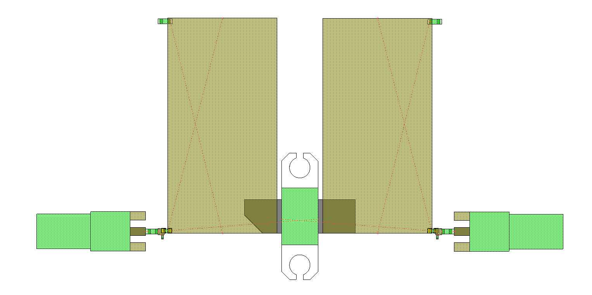

<p align="center">
  <a href="README.md">Русский</a> | <a href="README.en.md">English</a> | <b>Deutsch</b>
</p>

# 2sk2974-1g2-match: UHF-Leistungsverstärker-Anpassungsnetzwerk mit 2SK2974 bei 1,2 GHz

Dieses Repository enthält die numerische Simulation, Schaltungsoptimierung und das Layout-Design eines Anpassungsnetzwerks und einer Leistungsverstärkerstufe auf Basis des **2SK2974** UHF-N-Kanal-Leistungs-MOSFETs bei einer Betriebsfrequenz von **1,2 GHz (1200 MHz)** mit $50\ \Omega$-Referenztoren.

Das Projekt wurde in **Cadence AWR Microwave Office (MWO)** entwickelt und veranschaulicht den vollständigen dreistufigen Entwicklungsprozess:
1. **Ideale Schaltung** mit konzentrierten Elementen (L-Glieder).
2. **Streifenleitungsschaltung** unter Berücksichtigung der FR-4-Substratparameter, Lambda-Viertel-Vorspannungsnetzwerke und gemessener SMA-Steckverbinderübergänge.
3. **Reale Streifenleitungsschaltung** mit SMD-Bauelementemodellen von Herstellern (ATC, Coilcraft/Murata), Touchstone-Streuparametern des Transistors (`2sk2974.s2p`) und Gehäuse-Footprint (DXF).

---

## Projektstruktur

```text
├── cad/                                        # 2D-CAD-Gehäuse-Footprints und Layoutdateien
│   └── 2sk2974_awr_footprint.dxf               # 2D-CAD-Footprint des 2SK2974-Gehäuses für AWR Layout
├── calculations/                               # Mathematische Modelle (Mathcad, SMath)
│   └── .gitkeep
├── docs/
│   └── images/                                 # Dokumentationsgrafiken, Schaltpläne und Simulationsergebnisse
│       ├── layout_pcb_amplifier_2sk2974.png    # Basis-Leiterplattenlayout in AWR MWO
│       ├── layout_pcb_smd_amplifier_2sk2974.png # Detailliertes Layout mit SMD-Lötpads
│       ├── plot_microstrip_s21_gain.png        # Vorwärtsübertragungsgewinn |S21| der Streifenleitungsschaltung
│       ├── plot_microstrip_vswr.png            # Stehwellenverhältnis (VSWR) der Tore 1 und 2
│       ├── plot_s11_frequency_response.png     # Frequenzgang des Reflexionsfaktors |S11| (ideale Schaltung)
│       ├── plot_s21_frequency_response.png     # Frequenzgang des Übertragungsgewinns |S21| (ideale Schaltung)
│       ├── plot_smd_s21_gain.png               # Übertragungsgewinn |S21| der realen SMD-Schaltung
│       ├── plot_smd_vswr_frequency_response.png # VSWR der realen SMD-Schaltung
│       ├── plot_vswr_frequency_response.png    # Stehwellenverhältnis (VSWR) der idealen Schaltung
│       ├── schematic_2sk2974_matching_1200mhz.png # Schaltplan der idealen Anpassungsschaltung
│       ├── schematic_microstrip_pa_2sk2974.png # Streifenleitungsschaltplan mit Bias und SMA
│       ├── schematic_microstrip_smd_2sk2974.png # Schaltplan mit realen Hersteller-SMD-Komponenten
│       ├── smith_chart_microstrip_s11_s22.png  # Smith-Diagramm S11 & S22 der Streifenleitungsschaltung
│       ├── smith_chart_s11_matching.png        # Smith-Diagramm für S11 (ideale Schaltung)
│       ├── smith_chart_s22_matching.png        # Smith-Diagramm für S22 (ideale Schaltung)
│       └── smith_chart_smd_s11_s22.png         # Smith-Diagramm S11 & S22 der SMD-Schaltung
├── simulation/                                 # Cadence AWR Microwave Office Projektdateien
│   ├── 2sk2974.s2p                             # Gemessene Streuparameter des Transistors (Touchstone 50–1500 MHz)
│   ├── amplifier_2sk2974_1200mhz_microstrip.emp # Projekt mit Streifenleitungsschaltung, SMA und Layout
│   ├── amplifier_2sk2974_1200mhz_smd_layout.emp # Projekt mit realen SMD-Komponenten und detailliertem Layout
│   └── transistor_2sk2974_matching_1200mhz.emp  # Projekt mit idealen konzentrierten Elementen
├── .gitignore                                  # Ausschlussregeln für EDA- und Betriebssystemdateien
├── LICENSE                                     # Vollständiger Lizenztext der CERN-OHL-P v2
├── README.de.md                                # Dokumentation in deutscher Sprache
├── README.en.md                                # Dokumentation in englischer Sprache
└── README.md                                   # Dokumentation in russischer Sprache
```

---

## Transistorparameter

Das aktive Bauelement ist ein Mitsubishi **2SK2974** Silizium-N-Kanal-HF-Leistungs-MOSFET.
Die Mehrfrequenz-Streuparameter sind in [`simulation/2sk2974.s2p`](simulation/2sk2974.s2p) von 50 bis 1500 MHz unter den Betriebsbedingungen $V_{dd} = 7,2\text{ V}$, Ruhestrom $I_d = 600\text{ mA}$ und Gehäusetemperatur $T_c = 25^\circ\text{C}$ hinterlegt.

Bei der Betriebsfrequenz $f_0 = 1,2\text{ GHz}$ lauten die Streuparameter bezogen auf $Z_0 = 50\ \Omega$:

$$\begin{aligned}
S_{11} &= 0,96198 \angle 178,34^\circ \\
S_{21} &= 0,19253 \angle 30,1079^\circ \\
S_{12} &= 0,03660 \angle 80,3997^\circ \\
S_{22} &= 0,93364 \angle -178,72^\circ
\end{aligned}$$

---

## Schaltungsaufbau und PCB-Layout

### 1. Ideale Schaltung mit konzentrierten Elementen

<p align="center">
  
  <br>
  <em>Abbildung 1 — Prinzipschaltbild des idealen 2SK2974-Anpassungsnetzwerks bei 1,2 GHz</em>
</p>

- **Eingangsanpassungsglied**: Parallelkondensator `C1 = 21,8 pF` und Serieninduktivität `L1 = 0,862 nH`.
- **Ausgangsanpassungsglied**: Serieninduktivität `L2 = 1,4 nH` und Parallelkondensator `C2 = 16,4 pF`.

### 2. Streifenleitungsschaltung mit Bias-Netzwerken und SMA-Verbindern

<p align="center">
  
  <br>
  <em>Abbildung 2 — Streifenleitungsschaltplan des Verstärkers mit Vorspannungs-Stubs und gemessenen SMA-Subschaltungen</em>
</p>

- **Substratparameter (`MSUB ID=SUB1`)**: FR-4 ($\varepsilon_r = 4,5$, $H = 1,0\text{ mm}$, $T = 35\ \mu\text{m}$, $\tan\delta = 0,015$, $\rho = 0,0172$).
- **HF-Verbinder**: Subschaltungen `SUBCKT NET="SMA_Measured_Thru"`.
- **Gleichspannungs-Trennkapazitäten**: `C2, C3 = 10000 pF` ($10\text{ nF}$).
- **Vorspannungsnetzwerke**: Lambda-Viertel-Streifenleitungsstubs `MLIN` ($W = 17,577\text{ mm}$, $L = 34,603\text{ mm}$) mit HF-Abblockkondensatoren `C5, C6 = 10000 pF` gegen Masse.

### 3. Reale Streifenleitungsschaltung mit SMD-Komponenten von Herstellern

<p align="center">
  
  <br>
  <em>Abbildung 3 — Streifenleitungsschaltplan mit realen ATC-Kondensatoren und Coilcraft-Induktivitätsmodellen</em>
</p>

- **DC-Trennkapazitäten**: Keramische Präzisionskondensatoren ATC 700A — `SUBCKT ID=S6, S2 NET="700A102G"` ($1000\text{ pF}$).
- **Eingangsparallelkapazität**: Parallelschaltung von ATC 100A-Kondensatoren — `SUBCKT ID=S9 NET="100A1R5B"` ($1,5\text{ pF}$) und `SUBCKT ID=S8 NET="100A120F"` ($12\text{ pF}$).
- **Ausgangsserieninduktivität**: Präzisions-HF-Induktivität Bauform 0402 — `SUBCKT ID=S4 NET="L0402SEr56"` ($0,56\text{ nH}$).
- **Ausgangsparallelkapazität**: ATC 100A-Kondensatoren — `SUBCKT ID=S7 NET="100A0R7"` ($0,7\text{ pF}$) und `SUBCKT ID=S5 NET="100A100F"` ($10\text{ pF}$).
- **Transistormodell**: Touchstone-Subschaltung `SUBCKT ID=S10 NET="2SK2974"` über `simulation/2sk2974.s2p`.
- **Streifenleitungszuleitungen**: $50\ \Omega$-Leitungen `MLIN ID=TL5, TL6` ($W = 2\text{ mm}$, $L = 1\text{ mm}$) und T-Glieder `MTEE` ($W = 5\text{ mm}$).

### 4. Leiterplattenlayout (PCB Layout)

<p align="center">
  
  
  <br>
  <em>Abbildung 4 — PCB-Layoutansichten in AWR MWO: Basiskonfiguration (links) und detailliertes Layout mit SMD-Lötpads (rechts)</em>
</p>

Das Layout beinhaltet die Montagefläche des 2SK2974-Gehäuses ([`cad/2sk2974_awr_footprint.dxf`](cad/2sk2974_awr_footprint.dxf)) mit Bohrungen zur Kühlkörperverschraubung, breite Vorspannungsflächen, SMD-Lötpads (ATC Case A und 0402) sowie End-Launch-SMA-Anschlussflächen.

---

## Simulationsergebnisse

### 1. Ergebnisse der idealen Schaltung

<p align="center">
  
  
  <br>
  <em>Abbildung 5 — Smith-Diagramme der idealen Schaltung: S11 (links) und S22 (rechts)</em>
</p>

<p align="center">
  
  
  <br>
  <em>Abbildung 6 — Frequenzgang von |S11| (links) und Übertragungsgewinn |S21| (rechts)</em>
</p>

<p align="center">
  
  <br>
  <em>Abbildung 7 — Stehwellenverhältnis (VSWR) am Eingang der idealen Schaltung</em>
</p>

- Eingangsreflexionsfaktor bei $1200\text{ MHz}$: $|S_{11}| = -18,32\text{ dB}$.
- Vorwärtsübertragungsfaktor (Stufenverstärkung): $|S_{21}| = +6,141\text{ dB}$.
- Resonanz-Stehwellenverhältnis: $\text{VSWR} \approx 1,27 - 1,36$ ($1,362$ bei $1204\text{ MHz}$).

### 2. Ergebnisse der Streifenleitungsschaltung (mit Bias und SMA)

<p align="center">
  
  <br>
  <em>Abbildung 8 — Smith-Diagramm für die Streifenleitungsschaltung: S11 (Dreieck) und S22 (Quadrat) bei 1,2 GHz</em>
</p>

<p align="center">
  
  
  <br>
  <em>Abbildung 9 — Streifenleitungsverstärker bei 1,2 GHz: VSWR der Tore 1 und 2 (links) und Vorwärtsübertragungsgewinn |S21| (rechts)</em>
</p>

- **Stehwellenverhältnis (VSWR) bei $1,2\text{ GHz}$**: $\text{VSWR}_1 = 1,442$, $\text{VSWR}_2 = 1,308$.
- **Vorwärtsübertragungsgewinn**: $|S_{21}| = +4,710\text{ dB}$ bei $1,2\text{ GHz}$.

### 3. Ergebnisse der realen Schaltung mit SMD-Komponenten

<p align="center">
  
  <br>
  <em>Abbildung 10 — Smith-Diagramm der Schaltung mit realen SMD-Komponenten: S(1,1) und S(2,2) im Bereich 1,20–1,21 GHz</em>
</p>

<p align="center">
  
  
  <br>
  <em>Abbildung 11 — Breitbandverhalten (0,5–1,5 GHz) mit realen SMD-Komponenten: VSWR (links) und Übertragungsgewinn |S21| (rechts)</em>
</p>

- **Smith-Diagramm**: Die Marker $S(1,1)$ und $S(2,2)$ im Band $1,20 - 1,21\text{ GHz}$ treffen präzise das $50\ \Omega$-Zentrum.
- **Stehwellenverhältnis (VSWR)**: Bei $1,2\text{ GHz}$ dokumentiert der Marker $\text{VSWR} = 1,374$ mit ausgeprägter Resonanzsenke.
- **Vorwärtsübertragungsgewinn ($S_{21}$)**: Bei $1,2\text{ GHz}$ beträgt die Stufenverstärkung **$+4,886\text{ dB}$** unter Berücksichtigung aller parasitären Eigenschaften der ATC- und Coilcraft-Komponenten, dielektrischer Verluste in FR-4 und SMA-Steckverbinderübergängen.

---

## Lizenz

Copyright (c) 2026 Ilya Kornilov

Diese Quelle beschreibt Open Hardware (offene Hardware) und ist unter der CERN-OHL-P v2 lizenziert. 
Sie dürfen diese Quelle unter den Bedingungen der CERN-OHL-P v2 (https://cern.ch/cern-ohl) 
weiterverbreiten, modifizieren und Produkte auf deren Grundlage herstellen.

Diese Quelle wird OHNE JEGLICHE AUSDRÜCKLICHE ODER STILLSCHWEIGENDE GEWÄHRLEISTUNG vertrieben, 
EINSCHLIESSLICH DER GEWÄHRLEISTUNG DER MARKTGÄNGIGKEIT, ZUFRIEDENSTELLENDEN QUALITÄT ODER EIGNUNG 
FÜR EINEN BESTIMMTEN ZWECK. Die geltenden Bedingungen entnehmen Sie bitte der CERN-OHL-P v2.
