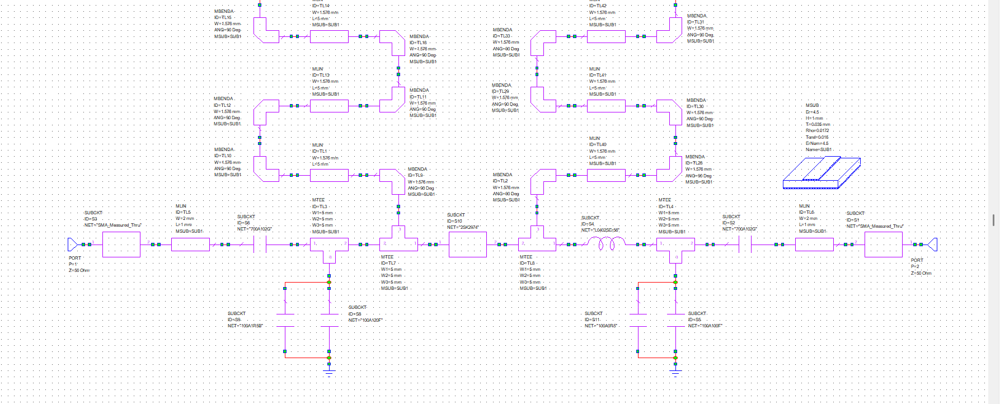
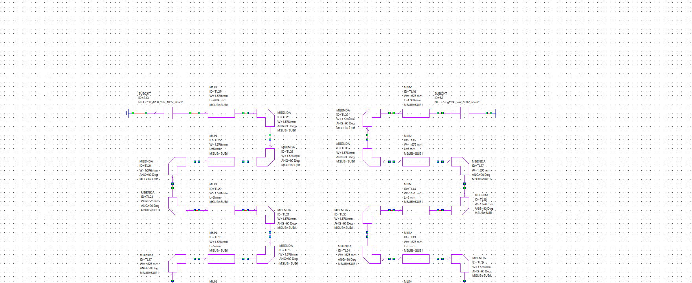
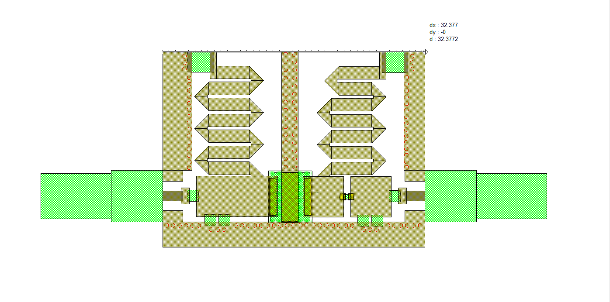
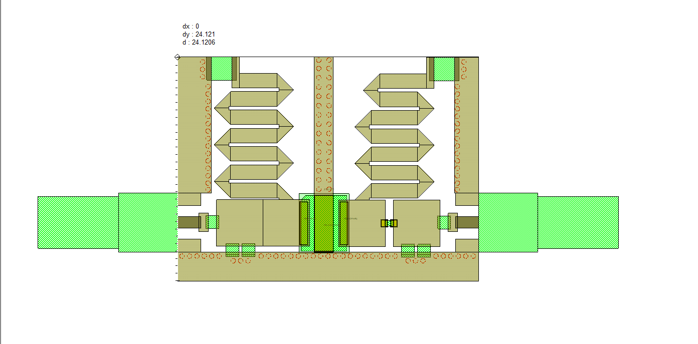
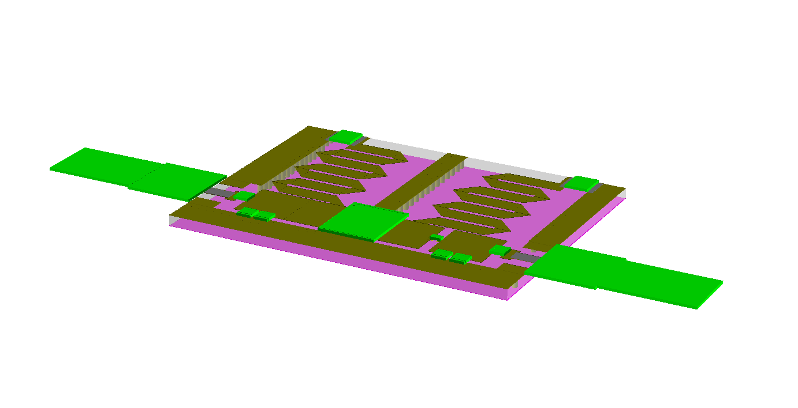

<p align="center">
  <a href="README.md">Русский</a> | <b>English</b> | <a href="README.de.md">Deutsch</a>
</p>

# 2sk2974-1g2-match: UHF 2SK2974 Power Amplifier Matching Network at 1.2 GHz

This repository contains the numerical simulation, circuit optimization, and layout design of an impedance matching network and power amplifier stage based on the **2SK2974** UHF N-channel power MOSFET operating at **1.2 GHz (1200 MHz)** with $50\ \Omega$ reference ports.

The project is developed in **Cadence AWR Microwave Office (MWO)** and illustrates a complete three-stage RF engineering progression:
1. **Ideal lumped-element circuit** (reactive L-sections).
2. **Distributed microstrip circuit** incorporating FR-4 substrate parameters, quarter-wave bias feed stubs, and measured SMA connector subcircuits.
3. **Realistic microstrip circuit** populated with vendor SMD passive component models (ATC, Coilcraft/Murata), Touchstone transistor scattering parameters (`2sk2974.s2p`), and a dedicated package footprint (DXF).

---

## Project Structure

```text
├── cad/                                        # 2D CAD package footprints and layout files
│   └── 2sk2974_awr_footprint.dxf               # 2D CAD footprint of 2SK2974 package for AWR Layout
├── calculations/                               # Mathematical models (Mathcad, SMath)
│   └── .gitkeep
├── docs/
│   └── images/                                 # Documentation figures, schematics, and simulation plots
│       ├── layout_pcb_smd_2d_dimension_x.png   # 2D PCB layout with horizontal board dimension (32.38 mm)
│       ├── layout_pcb_smd_2d_dimension_y.png   # 2D PCB layout with vertical board dimension (24.12 mm)
│       ├── layout_pcb_smd_3d_view.png          # 3D view of assembled amplifier PCB
│       ├── plot_microstrip_s21_gain.png        # Microstrip forward transmission gain |S21| plot
│       ├── plot_microstrip_vswr.png            # Microstrip Port 1 and Port 2 VSWR plot
│       ├── plot_s11_frequency_response.png     # |S11| (dB) vs frequency plot (ideal circuit)
│       ├── plot_s21_frequency_response.png     # |S21| (dB) transmission gain plot (ideal circuit)
│       ├── plot_smd_s21_gain.png               # Forward gain |S21| plot (realistic SMD circuit)
│       ├── plot_smd_vswr_frequency_response.png # VSWR plot (realistic SMD circuit)
│       ├── plot_vswr_frequency_response.png    # VSWR vs frequency plot (ideal circuit)
│       ├── schematic_2sk2974_matching_1200mhz.png # Ideal lumped matching circuit schematic
│       ├── schematic_microstrip_pa_2sk2974.png # Microstrip amplifier schematic with bias and SMA
│       ├── schematic_smd_amplifier_2sk2974.png # RF signal chain schematic with realistic SMD components
│       ├── schematic_smd_meander_bias_network.png # Quarter-wave meander bias network with C0G bypass caps
│       ├── smith_chart_microstrip_s11_s22.png  # Smith chart S11 & S22 of microstrip circuit
│       ├── smith_chart_s11_matching.png        # Input S11 Smith chart (ideal circuit)
│       ├── smith_chart_s22_matching.png        # Output S22 Smith chart (ideal circuit)
│       └── smith_chart_smd_s11_s22.png         # Smith chart S11 & S22 (realistic SMD circuit)
├── simulation/                                 # Cadence AWR Microwave Office project files
│   ├── 2sk2974.s2p                             # Transistor measured S-parameters (Touchstone 50–1500 MHz)
│   ├── amplifier_2sk2974_1200mhz_microstrip.emp # Project with microstrip schematic, SMA, and layout
│   ├── amplifier_2sk2974_1200mhz_smd_layout.emp # Project with realistic SMD components, meander bias, and layout
│   └── transistor_2sk2974_matching_1200mhz.emp  # Project with ideal lumped elements
├── .gitignore                                  # Git exclusion rules for CAD and OS artifacts
├── LICENSE                                     # Full text of CERN-OHL-P v2 license
├── README.de.md                                # German documentation
├── README.en.md                                # English documentation
└── README.md                                   # Russian documentation
```

---

## Transistor Parameters

The active device is a Mitsubishi **2SK2974** silicon N-channel RF power MOSFET.
Multi-frequency scattering parameters are provided in [`simulation/2sk2974.s2p`](simulation/2sk2974.s2p) across 50 to 1500 MHz under bias conditions $V_{dd} = 7.2\text{ V}$, quiescent current $I_d = 600\text{ mA}$, and case temperature $T_c = 25^\circ\text{C}$.

At the center frequency $f_0 = 1.2\text{ GHz}$, scattering parameters referenced to $Z_0 = 50\ \Omega$ are:

$$\begin{aligned}
S_{11} &= 0.96198 \angle 178.34^\circ \\
S_{21} &= 0.19253 \angle 30.1079^\circ \\
S_{12} &= 0.03660 \angle 80.3997^\circ \\
S_{22} &= 0.93364 \angle -178.72^\circ
\end{aligned}$$

---

## Circuit Modeling & PCB Layout

### 1. Ideal Lumped-Element Matching Circuit

<p align="center">
  
  <br>
  <em>Figure 1 — Circuit schematic of ideal 2SK2974 matching network at 1.2 GHz</em>
</p>

- **Input Matching L-Section**: shunt capacitor `C1 = 21.8 pF` and series inductor `L1 = 0.862 nH`.
- **Output Matching L-Section**: series inductor `L2 = 1.4 nH` and shunt capacitor `C2 = 16.4 pF`.

### 2. Microstrip Circuit with Bias Networks and SMA Connectors

<p align="center">
  
  <br>
  <em>Figure 2 — Microstrip amplifier schematic with bias decoupling stubs and measured SMA connector subcircuits</em>
</p>

- **Substrate Parameters (`MSUB ID=SUB1`)**: FR-4 ($\varepsilon_r = 4.5$, $H = 1.0\text{ mm}$, $T = 35\ \mu\text{m}$, $\tan\delta = 0.015$, $\rho = 0.0172$).
- **RF Connectors**: subcircuits `SUBCKT NET="SMA_Measured_Thru"`.
- **DC-Blocking Capacitors**: `C2, C3 = 10000 pF` ($10\text{ nF}$).
- **Gate and Drain Bias Networks**: quarter-wave microstrip stubs `MLIN` ($W = 17.577\text{ mm}$, $L = 34.603\text{ mm}$) terminated in bypass capacitors `C5, C6 = 10000 pF` to ground.

### 3. Realistic Microstrip Circuit with Vendor SMD Components

<p align="center">
  
  <br>
  <em>Figure 3 — RF amplifier signal chain schematic with vendor SMD components in Cadence AWR Microwave Office</em>
</p>

<p align="center">
  
  <br>
  <em>Figure 4 — Quarter-wave meander line DC bias feed chokes with C0G 1206 decoupling capacitors</em>
</p>

- **DC-Blocking Capacitors**: high-Q ceramic ATC 700A series — `SUBCKT ID=S6, S2 NET="700A102G"` ($1000\text{ pF}$).
- **Input Shunt Capacitance**: parallel pair of ATC 100A series capacitors — `SUBCKT ID=S9 NET="100A1R5B"` ($1.5\text{ pF}$) and `SUBCKT ID=S8 NET="100A120F"` ($12\text{ pF}$) (total capacitance $13.5\text{ pF}$).
- **Output Series Inductance**: precision 0402 thin-film RF inductor AVX Accu-L — `SUBCKT ID=S4 NET="L0402SEr56"` ($0.56\text{ nH}$).
- **Output Shunt Capacitance**: parallel pair of ATC 100A series capacitors — `SUBCKT ID=S11 NET="100A0R5"` ($0.5\text{ pF}$) and `SUBCKT ID=S5 NET="100A100F"` ($10\text{ pF}$) (total capacitance $10.5\text{ pF}$).
- **DC Bias Networks (RF Chokes)**: quarter-wave lines folded into compact meanders (`MBENDA` $90^\circ$ and `MLIN` sections with $W = 1.576\text{ mm}$ for $Z_0 = 50\ \Omega$), terminated into RF bypass shunt capacitors `SUBCKT ID=S13, S7 NET="c0g1206_2n2_100V_shunt"` ($2.2\text{ nF}$, $100\text{ V}$, SMD 1206, C0G/NP0 dielectric) to ground.
- **Transistor Model**: Touchstone subcircuit `SUBCKT ID=S10 NET="2SK2974"` linked to `simulation/2sk2974.s2p`.
- **Microstrip Feeder Lines & Connectors**: $50\ \Omega$ transitions `SUBCKT NET="SMA_Measured_Thru"`, feed lines `MLIN ID=TL5, TL6` ($W = 2\text{ mm}$, $L = 1\text{ mm}$) and junctions `MTEE` ($W = 5\text{ mm}$).

### 4. PCB Layout

<p align="center">
  
  <br>
  <em>Figure 5 — 2D PCB layout in AWR Microwave Office: horizontal board dimension ($32.38\text{ mm}$)</em>
</p>

<p align="center">
  
  <br>
  <em>Figure 6 — 2D PCB layout in AWR Microwave Office: vertical board dimension ($24.12\text{ mm}$)</em>
</p>

<p align="center">
  
  <br>
  <em>Figure 7 — 3D layout view of the complete amplifier board assembly (3D Layout View)</em>
</p>

- **Board Dimensions**: ultra-compact form factor measuring **$32.38 \times 24.12\text{ mm}$** (substrate footprint $\approx 7.8\text{ cm}^2$).
- **Meander Bias Chokes**: high-frequency quarter-wave gate and drain feed lines are folded into tight meanders with $90^\circ$ mitered bends, reducing board height by more than 50%.
- **Power Decoupling**: footprints for 1206-package $2.2\text{ nF}$ SMD capacitors grounded through low-inductance via stitching arrays.
- **Shielding and Thermal Relief**: ground via fencing along RF traces and bias lines, coplanar ground planes, and a central cutout with a metallized landing pad for the 2SK2974 power transistor flange ([`cad/2sk2974_awr_footprint.dxf`](cad/2sk2974_awr_footprint.dxf)) for direct heatsink mounting.
- **RF Ports**: solder lands tailored for end-launch SMA connectors ensuring a seamless transition to $50\ \Omega$ microstrip lines.

---

## Simulation Results

### 1. Lumped-Element Model Results

<p align="center">
  
  
  <br>
  <em>Figure 8 — Smith chart reflection loci for ideal circuit: S11 (left) and S22 (right)</em>
</p>

<p align="center">
  
  
  <br>
  <em>Figure 9 — Frequency response of input reflection |S11| (left) and forward gain |S21| (right)</em>
</p>

<p align="center">
  
  <br>
  <em>Figure 10 — Voltage Standing Wave Ratio (VSWR) versus frequency for ideal model</em>
</p>

- Input reflection coefficient at $1200\text{ MHz}$: $|S_{11}| = -18.32\text{ dB}$.
- Forward transmission coefficient: $|S_{21}| = +6.141\text{ dB}$.
- Resonance VSWR: $\text{VSWR} \approx 1.27 - 1.36$ ($1.362$ at $1204\text{ MHz}$).

### 2. Microstrip Circuit Model Results (with Bias and SMA Transitions)

<p align="center">
  
  <br>
  <em>Figure 11 — Smith chart impedance plot for microstrip circuit: S11 (triangle) and S22 (square) at 1.2 GHz</em>
</p>

<p align="center">
  
  
  <br>
  <em>Figure 12 — Microstrip circuit performance at 1.2 GHz: Port 1 & 2 VSWR (left) and forward gain |S21| (right)</em>
</p>

- **Port VSWR at $1.2\text{ GHz}$**: $\text{VSWR}_1 = 1.442$, $\text{VSWR}_2 = 1.308$.
- **Forward Gain**: $|S_{21}| = +4.710\text{ dB}$ at $1.2\text{ GHz}$.

### 3. Realistic Model Results with Vendor SMD Components

<p align="center">
  
  <br>
  <em>Figure 13 — Smith chart locus of the vendor SMD component model: S(1,1) and S(2,2) across 1.20–1.21 GHz</em>
</p>

<p align="center">
  
  <br>
  <em>Figure 14 — Frequency response of VSWR with vendor SMD components across 0.5–1.5 GHz</em>
</p>

<p align="center">
  
  <br>
  <em>Figure 15 — Frequency response of forward transmission gain |S21| across 0.5–1.5 GHz</em>
</p>

- **Smith Chart Impedance Match**: markers for $S(1,1)$ and $S(2,2)$ over $1.20 - 1.21\text{ GHz}$ are positioned directly at the $50\ \Omega$ center.
- **Voltage Standing Wave Ratio (VSWR)**: at $1.2\text{ GHz}$, the marker indicates $\text{VSWR} = 1.374$ with a sharp resonance minimum.
- **Forward Transmission Gain ($S_{21}$)**: at $1.2\text{ GHz}$, forward gain achieves **$+4.886\text{ dB}$**, accounting for all parasitic reactances of ATC capacitors, Coilcraft inductor, dielectric losses of FR-4, and SMA connector transitions.

---

## License

Copyright (c) 2026 Ilya Kornilov

This source describes Open Hardware and is licensed under the CERN-OHL-P v2. 
You may redistribute and modify this source and make products using it under 
the terms of the CERN-OHL-P v2 (https://cern.ch/cern-ohl).

This source is distributed WITHOUT ANY EXPRESS OR IMPLIED WARRANTY, 
INCLUDING OF MERCHANTABILITY, SATISFACTORY QUALITY AND FITNESS FOR A 
PARTICULAR PURPOSE. Please see the CERN-OHL-P v2 for applicable conditions.
