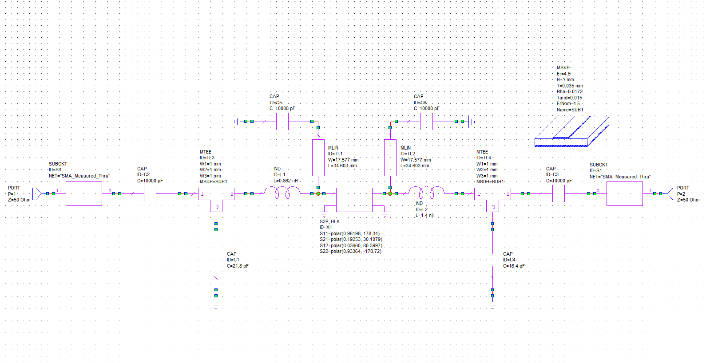
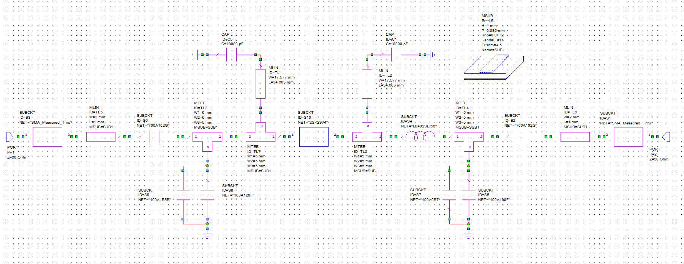
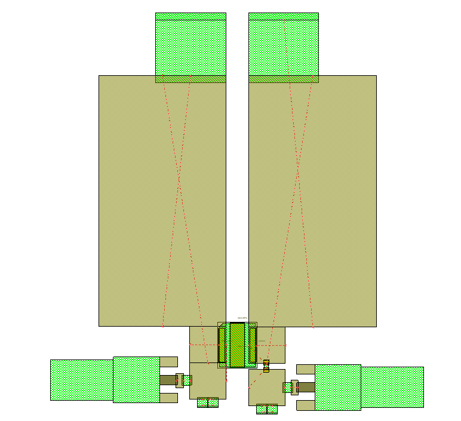
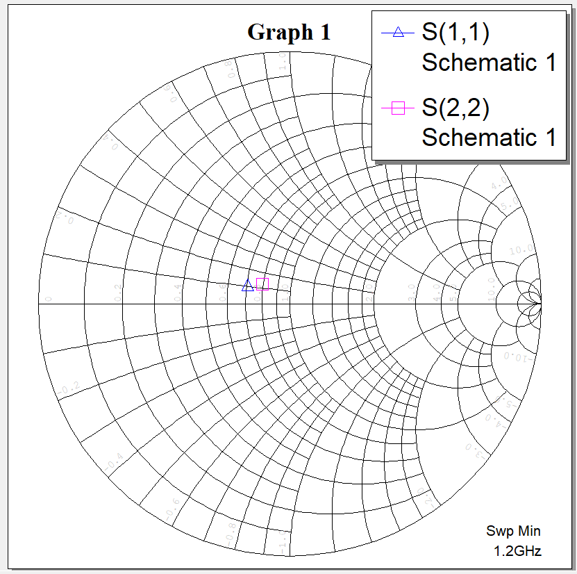
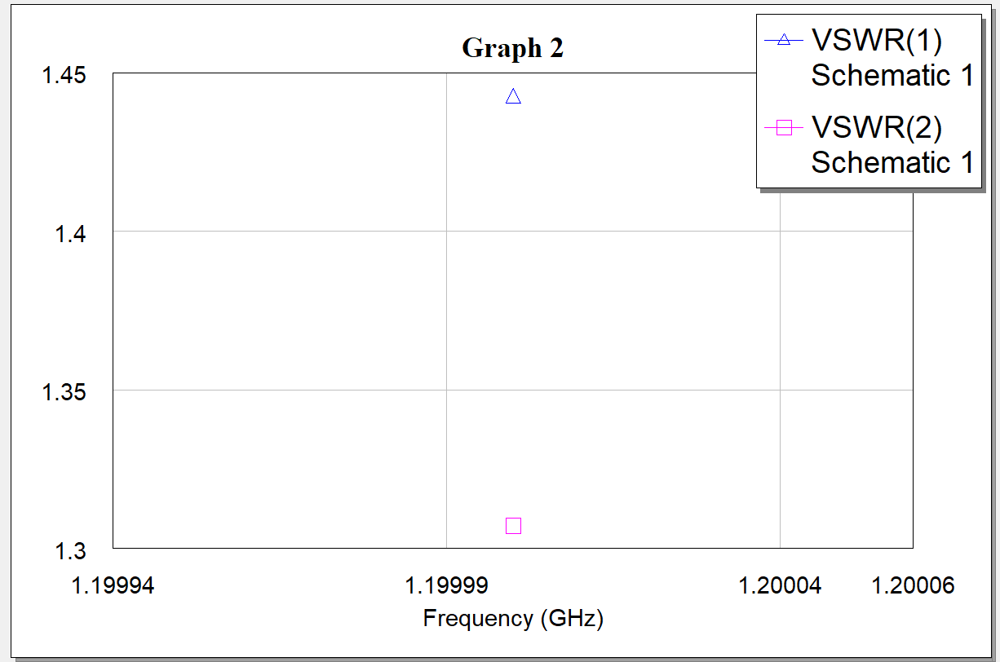
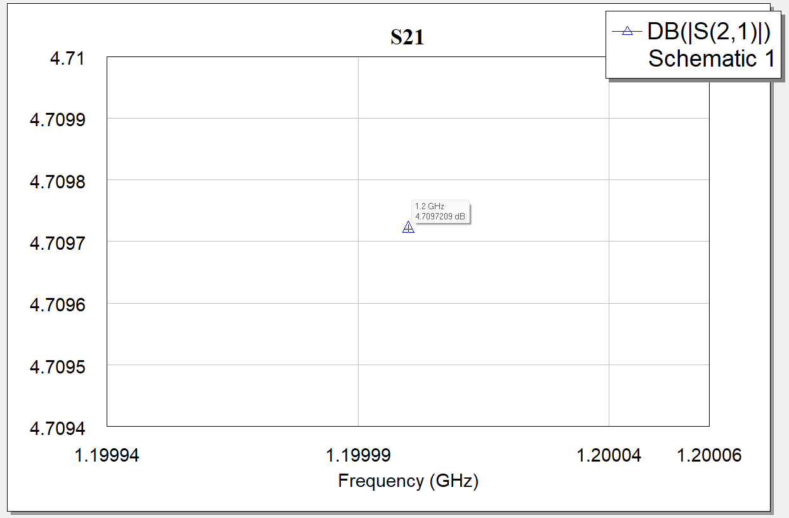
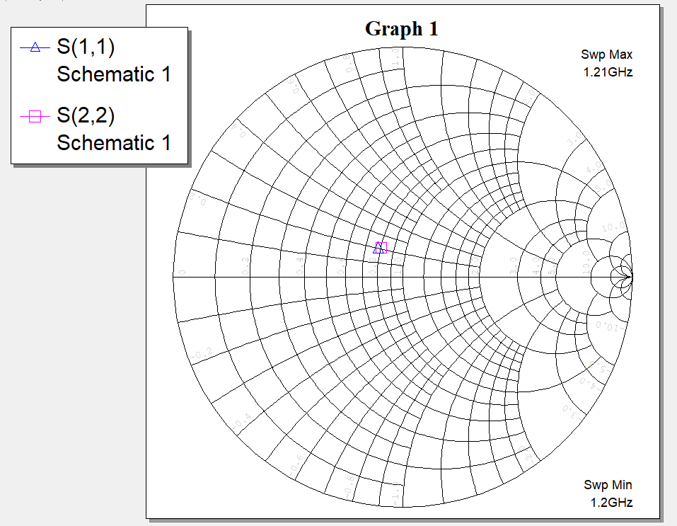
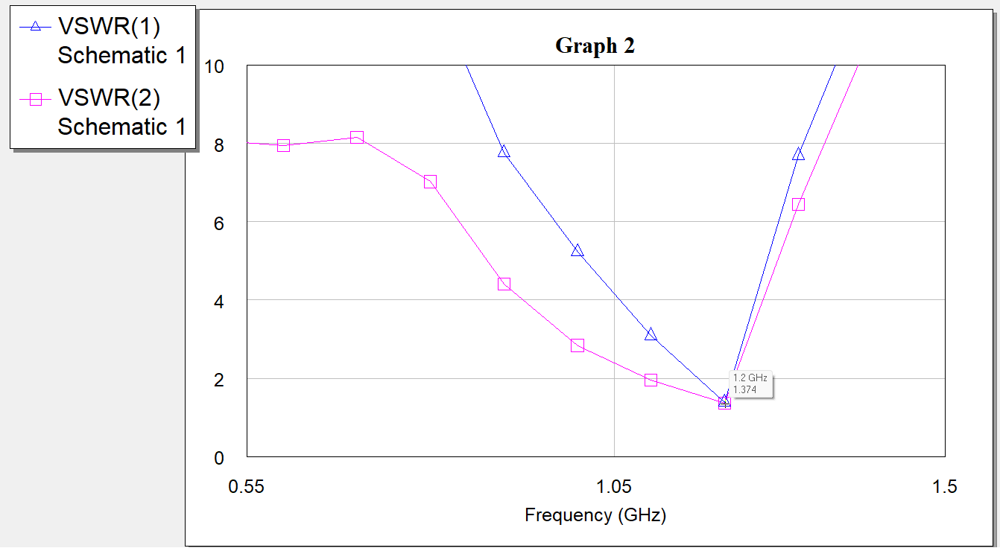
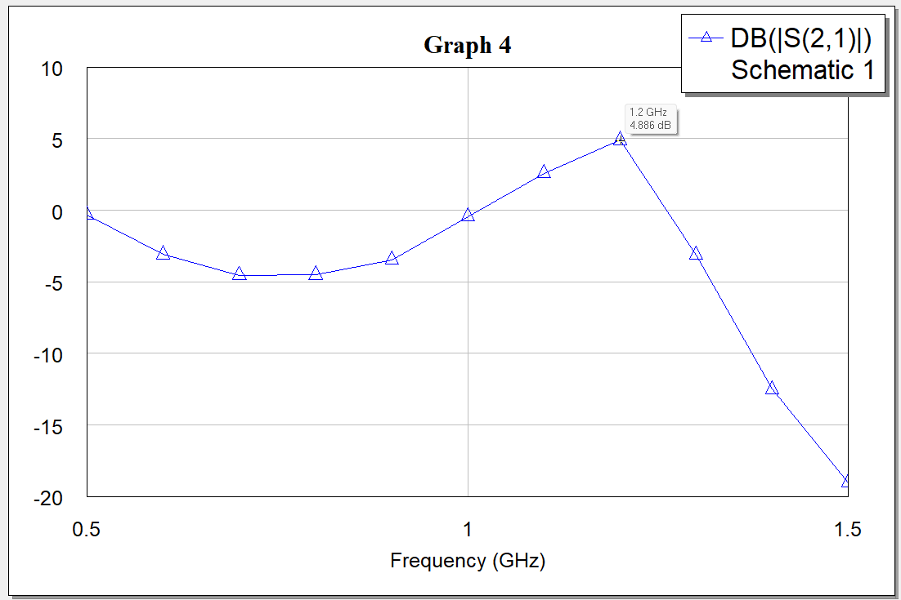

<p align="center">
  <b>Русский</b> | <a href="README.en.md">English</a> | <a href="README.de.md">Deutsch</a>
</p>

# 2sk2974-1g2-match: Согласование четырехполюсника СВЧ-усилителя на транзисторе 2SK2974 (1.2 ГГц)

Данный репозиторий содержит проект численного моделирования и топологического проектирования согласующей цепи и усилительного каскада мощности на базе СВЧ N-канального полевого транзистора (MOSFET) **2SK2974** со стандартным 50-омным трактом на рабочей частоте **1.2 ГГц (1200 МГц)**.

Моделирование выполнено в среде САПР **Cadence AWR Microwave Office (MWO)**. Проект демонстрирует полный цикл инженерного проектирования в три этапа:
1. **Идеальная схема** на сосредоточенных реактивных элементах (L-звенья).
2. **Микрополосковая схема** с учетом параметров диэлектрической подложки FR-4, четвертьволновых шлейфов подачи питания/смещения и измеренных характеристик концевых разъемов SMA.
3. **Реалистичная микрополосковая схема** на базе реальных моделей высокодобротных SMD-компонентов производителей (ATC, Coilcraft/Murata), многочастотных Touchstone S-параметров транзистора (`2sk2974.s2p`) и топологического посадочного места (DXF footprint).

---

## Структура проекта

```text
├── cad/                                        # Твердотельные 3D-модели и топологические посадочные места
│   └── 2sk2974_awr_footprint.dxf               # 2D-футпринт корпуса транзистора 2SK2974 для AWR Layout
├── calculations/                               # Математические расчеты (Mathcad, SMath)
│   └── .gitkeep
├── docs/
│   └── images/                                 # Графические материалы, схемы и графики результатов
│       ├── layout_pcb_smd_amplifier_2sk2974.png # Топология печатной платы с контактными площадками SMD
│       ├── plot_microstrip_s21_gain.png        # Коэффициент передачи |S21| микрополосковой схемы
│       ├── plot_microstrip_vswr.png            # График КСВН портов 1 и 2 микрополосковой схемы
│       ├── plot_s11_frequency_response.png     # График |S11| (дБ) идеальной схемы
│       ├── plot_s21_frequency_response.png     # График передачи |S21| (дБ) идеальной схемы
│       ├── plot_smd_s21_gain.png               # График усиления |S21| схемы с реальными SMD-компонентами
│       ├── plot_smd_vswr_frequency_response.png # График КСВН схемы с реальными SMD-компонентами
│       ├── plot_vswr_frequency_response.png    # График КСВН (VSWR) идеальной схемы
│       ├── schematic_2sk2974_matching_1200mhz.png # Схема идеальной согласующей цепи
│       ├── schematic_microstrip_pa_2sk2974.png # Микрополосковая схема усилителя со шлейфами смещения и SMA
│       ├── schematic_microstrip_smd_2sk2974.png # Схема с реальными SMD-компонентами производителей
│       ├── smith_chart_microstrip_s11_s22.png  # Диаграмма Вольперта-Смита микрополосковой схемы
│       ├── smith_chart_s11_matching.png        # Диаграмма Вольперта-Смита для S11 идеальной схемы
│       ├── smith_chart_s22_matching.png        # Диаграмма Вольперта-Смита для S22 идеальной схемы
│       └── smith_chart_smd_s11_s22.png         # Диаграмма Вольперта-Смита схемы с SMD-компонентами
├── simulation/                                 # Проекты численного анализа AWR Microwave Office
│   ├── 2sk2974.s2p                             # Файл измеренных S-параметров транзистора (Touchstone 50–1500 МГц)
│   ├── amplifier_2sk2974_1200mhz_microstrip.emp # Проект с микрополосковой схемой, SMA и базовой топологией
│   ├── amplifier_2sk2974_1200mhz_smd_layout.emp # Проект с реальными SMD-компонентами и детальной топологией
│   └── transistor_2sk2974_matching_1200mhz.emp  # Проект с идеальной схемой на сосредоточенных элементах
├── .gitignore                                  # Правила исключения временных файлов САПР и ОС
├── LICENSE                                     # Текст лицензии CERN-OHL-P v2
├── README.de.md                                # Документация на немецком языке
├── README.en.md                                # Документация на английском языке
└── README.md                                   # Документация на русском языке
```

---

## Исходные параметры транзистора

Активный прибор — мощный кремниевый N-канальный МОП-транзистор (MOSFET) Mitsubishi **2SK2974**.
Многочастотная матрица параметров рассеяния представлена в файле [`simulation/2sk2974.s2p`](simulation/2sk2974.s2p) в диапазоне от 50 до 1500 МГц при напряжении стока $V_{dd} = 7.2\text{ В}$, токе покоя $I_d = 600\text{ мА}$ и температуре корпуса $T_c = 25^\circ\text{C}$.

На расчетной частоте $f_0 = 1.2\text{ ГГц}$ параметры относительно $Z_0 = 50\ \Omega$ составляют:

$$\begin{aligned}
S_{11} &= 0.96198 \angle 178.34^\circ \\
S_{21} &= 0.19253 \angle 30.1079^\circ \\
S_{12} &= 0.03660 \angle 80.3997^\circ \\
S_{22} &= 0.93364 \angle -178.72^\circ
\end{aligned}$$

---

## Схемотехническое моделирование и топология

### 1. Идеальная схема на сосредоточенных элементах

<p align="center">
  
  <br>
  <em>Рисунок 1 — Схема идеальной согласующей цепи транзистора 2SK2974 на частоту 1.2 ГГц</em>
</p>

- **Входная согласующая L-цепь**: параллельная емкость `C1 = 21.8 пФ` и последовательная индуктивность `L1 = 0.862 нГн`.
- **Выходная согласующая L-цепь**: последовательная индуктивность `L2 = 1.4 нГн` и параллельная емкость `C2 = 16.4 пФ`.

### 2. Микрополосковая схема с четвертьволновыми шлейфами и разъемами SMA

<p align="center">
  
  <br>
  <em>Рисунок 2 — Схема с микрополосковыми линиями, цепями смещения и моделями разъемов SMA</em>
</p>

- **Параметры подложки (`MSUB ID=SUB1`)**: FR-4 ($\varepsilon_r = 4.5$, $H = 1.0\text{ мм}$, $T = 35\text{ мкм}$, $\tan\delta = 0.015$, $\rho = 0.0172$).
- **ВЧ-разъемы**: подсхемы `SUBCKT NET="SMA_Measured_Thru"`.
- **Разделительные емкости**: конденсаторы `C2, C3 = 10000 пФ` ($10\text{ нФ}$).
- **Цепи подачи смещения затвора и стока**: четвертьволновые шлейфы `MLIN` ($W = 17.577\text{ мм}$, $L = 34.603\text{ мм}$) с блокировочными емкостями `C5, C6 = 10000 пФ` на землю.

### 3. Реалистичная микрополосковая схема на компонентах производителей

<p align="center">
  
  <br>
  <em>Рисунок 3 — Схема усилителя с моделями реальных SMD-компонентов ATC и Coilcraft</em>
</p>

- **Разделительные емкости (DC-block)**: прецизионные керамические СВЧ-конденсаторы ATC серии 700A — `SUBCKT ID=S6, S2 NET="700A102G"` ($1000\text{ пФ}$).
- **Входная параллельная емкость**: параллельное включение конденсаторов ATC серии 100A — `SUBCKT ID=S9 NET="100A1R5B"` ($1.5\text{ пФ}$) и `SUBCKT ID=S8 NET="100A120F"` ($12\text{ пФ}$).
- **Выходная согласующая индуктивность**: прецизионная СВЧ-индуктивность 0402 — `SUBCKT ID=S4 NET="L0402SEr56"` ($0.56\text{ нГн}$).
- **Выходная параллельная емкость**: конденсаторы ATC серии 100A — `SUBCKT ID=S7 NET="100A0R7"` ($0.7\text{ пФ}$) и `SUBCKT ID=S5 NET="100A100F"` ($10\text{ пФ}$).
- **Транзистор**: подсхема `SUBCKT ID=S10 NET="2SK2974"`, подключенная к файлу `simulation/2sk2974.s2p`.
- **Микрополосковые подводящие линии**: 50-омные линии `MLIN ID=TL5, TL6` ($W = 2\text{ мм}$, $L = 1\text{ мм}$) и тройники `MTEE` ($W = 5\text{ мм}$).

### 4. Топология печатной платы (PCB Layout)

<p align="center">
  
  <br>
  <em>Рисунок 4 — Топология печатной платы усилителя в Cadence AWR Microwave Office с контактными площадками SMD-компонентов</em>
</p>

Топология включает центральное посадочное место фланца мощного транзистора 2SK2974 (из файла [`cad/2sk2974_awr_footprint.dxf`](cad/2sk2974_awr_footprint.dxf)) с проушинами под крепежные винты радиатора, полигоны четвертьволновых шлейфов питания, посадочные площадки SMD-компонентов типоразмеров ATC Case A и 0402, а также концевые площадки под разъемы SMA End-Launch.

---

## Результаты моделирования

### 1. Результаты для схемы на идеальных элементах

<p align="center">
  
  
  <br>
  <em>Рисунок 5 — Диаграммы Вольперта-Смита идеальной схемы: S11 (слева) и S22 (справа)</em>
</p>

<p align="center">
  
  
  <br>
  <em>Рисунок 6 — Частотные зависимости |S11| (слева) и коэффициента усиления |S21| (справа) идеальной схемы</em>
</p>

<p align="center">
  
  <br>
  <em>Рисунок 7 — Частотная зависимость КСВН по входу идеальной схемы</em>
</p>

- Входной коэффициент отражения на $1200\text{ МГц}$: $|S_{11}| = -18.32\text{ дБ}$.
- Коэффициент передачи (усиление каскада): $|S_{21}| = +6.141\text{ дБ}$.
- КСВН в окрестности резонанса: $\text{VSWR} \approx 1.27 - 1.36$ ($1.362$ на $1204\text{ МГц}$).

### 2. Результаты для микрополосковой схемы со шлейфами смещения и SMA

<p align="center">
  
  <br>
  <em>Рисунок 8 — Диаграмма Вольперта-Смита для микрополосковой схемы: S11 (треугольник) и S22 (квадрат) на частоте 1.2 ГГц</em>
</p>

<p align="center">
  
  
  <br>
  <em>Рисунок 9 — Параметры микрополоскового усилителя на частоте 1.2 ГГц: КСВН портов 1 и 2 (слева) и коэффициент усиления |S21| (справа)</em>
</p>

- **КСВН портов на $1.2\text{ ГГц}$**: $\text{VSWR}_1 = 1.442$, $\text{VSWR}_2 = 1.308$.
- **Коэффициент передачи**: $|S_{21}| = +4.710\text{ дБ}$ на частоте $1.2\text{ ГГц}$.

### 3. Результаты для реалистичной схемы на SMD-компонентах производителей

<p align="center">
  
  <br>
  <em>Рисунок 10 — Диаграмма Вольперта-Смита схемы на реальных SMD-компонентах: S(1,1) и S(2,2) в полосе 1.20–1.21 ГГц</em>
</p>

<p align="center">
  
  <br>
  <em>Рисунок 11 — Частотная зависимость КСВН усилителя на реальных SMD-компонентах в диапазоне 0.5–1.5 ГГц</em>
</p>

<p align="center">
  
  <br>
  <em>Рисунок 12 — Частотная зависимость коэффициента передачи |S21| (усиления) в диапазоне 0.5–1.5 ГГц</em>
</p>

- **Диаграмма Вольперта-Смита**: маркеры коэффициентов отражения $S(1,1)$ и $S(2,2)$ в диапазоне $1.20 - 1.21\text{ ГГц}$ точно локализованы в центре диаграммы ($50\ \Omega$).
- **Коэффициент стоячей волны (КСВН)**: на частоте $1.2\text{ ГГц}$ маркер фиксирует величину **$\text{VSWR} = 1.374$** (кривая демонстрирует глубокий резонансный минимум).
- **Коэффициент передачи ($S_{21}$)**: на рабочей частоте $1.2\text{ ГГц}$ пиковый коэффициент передачи составляет **$+4.886\text{ дБ}$** при учете всех паразитных параметров реальных компонентов ATC и Coilcraft, диэлектрических потерь FR-4 и разъемов SMA.

---

## Лицензия

Copyright (c) 2026 Илья Корнилов

Этот исходный документ описывает открытое аппаратное обеспечение (Open Hardware) и распространяется под лицензией CERN-OHL-P v2. 
Вы можете распространять и изменять этот исходный документ, а также производить на его основе продукты в соответствии с 
условиями лицензии CERN-OHL-P v2 (https://cern.ch/cern-ohl).

Этот исходный документ распространяется БЕЗ КАКИХ-ЛИБО ЯВНЫХ ИЛИ ПОДРАЗУМЕВАЕМЫХ ГАРАНТИЙ, 
ВКЛЮЧАЯ ГАРАНТИИ ТОВАРНОЙ ПРИГОДНОСТИ, УДОВЛЕТВОРИТЕЛЬНОГО КАЧЕСТВА ИЛИ СООТВЕТСТВИЯ 
КОНКРЕТНЫМ ЦЕЛЯМ. Пожалуйста, ознакомьтесь с условиями CERN-OHL-P v2 для получения подробной информации.
